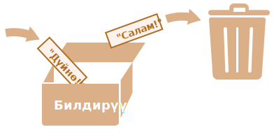

# Өзгөрмөлөр

Көпчүлүк учурда, JavaScript тиркемеси маалымат менен иштеши керек. Бул жерде эки мисал келтирилген:
1. Интернет-дүкөн -- маалымат сатылуучу буюмдарды жана соода себетин камтышы мүмкүн.
2. Баарлашуу тиркемеси -- маалымат колдонуучуларды, билдирүүлөрдү ж.б. көптөгөн нерселерди камтышы мүмкүн.

Өзгөрмөлөр бул маалыматтарды сактоо үчүн колдонулат.

## Өзгөрмө

[Өзгөрмө](https://en.wikipedia.org/wiki/Variable_(computer_science)) -- бул берилмелер үчүн "аталган сактагыч". Биз товарларды, келүүчүлөрдү жана башка берилмелерди сактоо үчүн өзгөрмөлөрдү колдоно алабыз.

JavaScript'те өзгөрмө түзүү үчүн, `let` ачкыч сөзүн колдонуңуз.

Төмөнкү нускама "билдирүү" аталышы менен өзгөрмө түзөт (башкача айтканда: *жарыялайт*):

```js
let message;
```

Эми `=` өздөштүрүү оператору аркылуу ага берилмелерди киргизе алабыз:

```js
let message;

*!*
message = 'Салам'; // 'Салам' сабын `message` деп аталган өзгөрмөдө сактоо
*/!*
```

Сап эми өзгөрмө менен байланышкан эстутум аймагына сакталат. Биз ага өзгөрмө аты менен кире алабыз:

```js run
let message;
message = 'Салам!';

*!*
alert(message); // өзгөрмөнүн мазмунун көрсөтөт
*/!*
```

Кыскача айтканда, биз өзгөрмөнүн жарыялоосун жана берилмелерди жазууну бир сапка бириктире алабыз:

```js run
let message = 'Салам!'; // өзгөрмөнү аныктайбыз жана ага маанисин беребиз

alert(message); // Салам!
```

Ошондой эле бир нече өзгөрмөлөрдү бир сапта жарыялай алабыз:

```js no-beautify
let user = 'Жакыя', age = 25, message = 'Салам';
```

Мындай ыкма кыскараак көрүнүшү мүмкүн, бирок биз муну сунуштабайбыз. Жакшыраак окулушу үчүн, ар бир өзгөрмөнү жаңы сапта жарыялаңыз.

Көп саптуу версиясы бир аз узунураак, бирок окууга оңоюраак:

```js
let user = 'Жакыя';
let age = 25;
let message = 'Салам';
```

Кээ бир адамдар бир нече өзгөрмөлөрдү мындай көп саптуу стилинде аныкташат:

```js no-beautify
let user = 'Жакыя',
  age = 25,
  message = 'Салам';
```

...Же жадагалса саптын башында үтүр менен:

```js no-beautify
let user = 'Жакыя'
  , age = 25
  , message = 'Салам';
```

Негизинен, бул варианттардын баары бирдей иштейт. Демек, бул жеке табит жана эстетика маселеси.

````smart header="`let` ордуна `var`"
Эски скрипттерде дагы башка, `let` ордуна `var` ачкыч сөзүн таба аласыз:

```js
*!*var*/!* message = 'Салам';
```

`var` ачкыч сөзү `let` менен *дээрлик* бирдей. Ал өзгөрмөнү жарыялайт, бирок бир аз башкача, "эскирген" жол менен.

`let` жана `var` ортосунда назик айырмачылыктар бар, бирок алар биз үчүн азырынча маанилүү эмес. Биз аларды <info:var> бөлүмүндө кененирээк карап чыгабыз.
````

## Жашоодогу аналогия

Эгерде өзгөрмөнү берилмелер үчүн уникалдуу аталышы бар "куту" катары элестетсек, биз "өзгөрмө" түшүнүгүн оңой эле түшүнө алабыз.

Мисалы үчүн, `message` өзгөрмөсүн `"билдирүү"` деп аталган жана анын ичиндеги `"Салам!"` мааниси бар куту катары элестетүүгө болот.


Биз кутуга ар кандай маанини сала алабыз.

Ошондой эле биз аны каалаганча көп жолу өзгөртө алабыз:

```js run
let message;

message = 'Салам!';

message = 'Дүйнө!'; // мааниси өзгөртүлдү

alert(message);
```

Маани өзгөртүлгөндө, эски берилмелер өзгөрмөдөн жок кылынат:



Ошондой эле биз эки өзгөрмөнү жарыялап, берилмелерди биринен экинчисине көчүрө алабыз.

```js run
let hello = 'Салам дүйнө!';

let message;

*!*
// hello өзгөрмөсүндөгү 'Салам дүйнө' маанисин message өзгөрмөсүнө көчүрөбүз
message = hello;
*/!*

// эми эки өзгөрмө бирдей берилмелерди камтыйт
alert(hello); // Салам дүйнө!
alert(message); // Салам дүйнө!
```

````warn header="Кайрадан жарыялоо катаны жаратат"
Өзгөрмө бир гана жолу жарыяланышы керек.

Бир эле өзгөрмөнүн кайталанган жарыялоосу ката болуп саналат:

```js run
let message = "Ушул";

// 'let' ачкыч сөзүнүн кайталанышы катага алып келет:
let message = "Ошол"; // SyntaxError: 'message' has already been declared
```
Ошондуктан, биз өзгөрмөнү бир гана жолу жарыялап, ага `let`'сиз кайрылышыбыз керек.
````

```smart header="Функционалдуу тилдер"
Өзгөрмө маанилерин өзгөртүүгө тыюу салган [Scala](http://www.scala-lang.org/) же [Erlang](http://www.erlang.org/) сыяктуу [функционалдуу](https://en.wikipedia.org/wiki/Functional_programming) программалоо тилдери бар экенин белгилей кетүү кызык.

Мындай тилдерде бир жолу "кутуда" сакталган маани түбөлүккө ошол жерде калат. Эгер башка нерсени сактоо керек болсо, тил бизди жаңы кутуча түзүүгө (жаңы өзгөрмө жарыялоого) мажбурлайт. Биз эски өзгөрмөнү колдоно албайбыз.

Бир караганда бул бир аз кызыктай көрүнгөнү менен, бул тилдер олуттуу иштеп чыгууга жөндөмдүү. Мындан тышкары, бул чектөө кээ бир артыкчылыктарды берген параллелдүү эсептөөлөр сыяктуу аймактар бар. Мындай тилди үйрөнүү (сиз аны жакында колдонууну пландабасаңыз да) акыл-эсти кеңейтүү үчүн сунушталат.
```

## Өзгөрмөлөрдү атоо [#variable-naming]

JavaScript'те өзгөрмө аттарына эки чектөө бар:

1. Өзгөрмөнүн аты тамгаларды, сандарды же `$` жана `_` белгилерин гана камтышы керек.
2. Биринчи символ сан болбошу керек.

Жарактуу аттардын мисалдары:

```js
let userName;
let test123;
```

Аты бир нече сөздү камтыса, көбүнчө [төө нотациясы](https://en.wikipedia.org/wiki/CamelCase) (camelCase) колдонулат. Башкача айтканда, сөздөр бири-бирин ээрчийт, анда ар бир кийинки сөз баш тамга менен башталат: `myVeryLongName`.

Эң кызыгы -- аттарда доллар белгиси `'$'` жана ылдыйкы сызыкча `'_'` да колдонулушу мүмкүн. Алар тамгалар сыяктуу эч кандай өзгөчө мааниси жок кадимки белгилер.

Бул аттар жарактуу:

```js run untrusted
let $ = 1; // "$" аты менен өзгөрмө жарыяланды
let _ = 2; // ал эми "_" аты менен өзгөрмө

alert($ + _); // 3
```

Туура эмес өзгөрмө аттарынын мисалдары:

```js no-beautify
let 1a; // сан менен башталуу мүмкүн эмес

let my-name; // атта '-' дефисти коюуга болбойт
```

```smart header="Регистр маанилүү"
`apple` жана `APPLE` деп аталган өзгөрмөлөр -- бул эки башка өзгөрмө.
```

````smart header="Латын эмес тамгаларга уруксат берилет, бирок сунушталбайт"
Каалаган тилди, анын ичинде кирил тамгаларын же жадагалса иероглифтерди колдонууга болот:

```js
let аталыш = '...';
let 我 = '...';
```

Техникалык жактан бул жерде ката жок. Мындай аттарга уруксат берилген, бирок өзгөрмө аттарында англис тилин колдонуу боюнча эл аралык келишим бар. Кичинекей скрипт жазып жатсак да, анын алдында өмүрү узун болушу мүмкүн. Башка өлкөлөрдөн келгендер аны бир нече жолу окууга туура келиши мүмкүн.
````

````warn header="Резервделген аттар"
[Резервделген сөздөрдүн тизмеси](https://developer.mozilla.org/en-US/docs/Web/JavaScript/Reference/Lexical_grammar#Keywords) бар. Аларды өзгөрмө аттары катары колдонууга болбойт, анткени алар тилдин өзү тарабынан колдонулат.

Мисалы: `let`, `class`, `return`, жана `function` резервделген.

Төмөндөгү код синтаксис катасын жаратат:

```js run no-beautify
let let = 5; // өзгөрмөнү "let" деп атоого болбойт, ката!
let return = 5; // ошондой эле "return" деп атоого болбойт, ката!
```
````

````warn header="`use strict` колдонбостон өзгөрмө түзүү"

Адатта, биз өзгөрмөнү колдонуудан мурун аны аныкташыбыз керек. Бирок мурда `let` колдонбостон, жөн гана маани берүү менен өзгөрмө түзүүгө техникалык жактан мүмкүн болгон. Эски скрипттер менен шайкештикти сактоо үчүн скрипттерибизге `use strict` иштетпесек да, бул азыр деле иштейт.

```js run no-strict
// эсбелги: бул мисалда "use strict" колдонулбайт

num = 5; // "num" өзгөрмөсү мурда жок болгондо, ал түзүлөт

alert(num); // 5
```

Бул жаман тажрыйба, ал катуу режиминде катага алып келет:

```js
"use strict";

*!*
num = 5; // ката: num is not defined
*/!*
```
````

## Константалар

Константа (өзгөрүлбөс) өзгөрмөнү жарыялоо үчүн, `let` ордуна `const` колдонуңуз:

```js
const myBirthday = '18.04.1982';
```

`const` аркылуу жарыяланган өзгөрмөлөр "константалар" деп аталат. Аларды өзгөртүүгө болбойт. Мындай кылуу аракети катага алып келет:

```js run
const myBirthday = '18.04.1982';

myBirthday = '01.01.2001'; // ката, константаны өзгөртүүгө болбойт!
```

Эгерде программист өзгөрмө эч качан өзгөрбөйт деп ишенсе, ал муну кепилдей алат жана аны `const` аркылуу жарыялоо менен ар бирине так кабарлай алат.

### Баш тамгадагы константалар

Скрипт аткарылганга чейин белгилүү болгон эстеп калууга кыйын маанилер үчүн константаларды тергеме ат катары колдонуу тажрыйбасы кеңири таралган.

Мындай константалардын аталыштары баш тамгалар жана ылдыйкы сызыкчалар менен жазылат.

Мисалы, "он алтылык форматта" ар кандай түстөр үчүн константаларды жасайлы:

```js run
const COLOR_RED = "#F00";
const COLOR_GREEN = "#0F0";
const COLOR_BLUE = "#00F";
const COLOR_ORANGE = "#FF7F00";

// ...түстү тандоо керек болгондо
let color = COLOR_ORANGE;
alert(color); // #FF7F00
```

Артыкчылыктары:

- `"#FF7F00"` дегенге караганда `COLOR_ORANGE` эстеп калуу далай оңоюраак.
- `"#FF7F00"` киргизүүдө ката кетирүү `COLOR_ORANGE` киргизүүгө караганда далай оңоюраак.
- Кодду окуп жатканда `#FF7F00` дегенге караганда `COLOR_ORANGE` далай түшүнүктүүрөөк болот.

Качан константа үчүн баш тамгаларды колдонушубуз керек жана качан аны кадимкидей аташыбыз керек? Келгиле, бул маселени чечели.

"Константа" болуу жөн гана өзгөрмөнүн мааниси эч качан өзгөрбөй турганын билдирет. Бирок аткарылганга чейин белгилүү болгон константалар бар (кызыл түстүн он алтылык мааниси сыяктуу) жана скрипттин аткарылышы учурунда *эсептелүүчү*, бирок алар башында жарыялангандан кийин өзгөрбөй турган константалар да бар.

Мисалы үчүн:

```js
const pageLoadTime = /* веб-баракчаны жүктөөгө сарпталган убакыт */;
```

`pageLoadTime` константасынын мааниси баракчаны жүктөөдөн мурун белгилүү эмес, андыктан ал кадимкидей аталат. Бирок ал дагы эле константа, анткени жарыялангандан кийин өзгөрбөйт.

Башкача айтканда, баш тамгалар менен аталган константалар "катуу коддолгон" маанилер үчүн тергеме ат катары гана колдонулат.

## Нерселерди туура атаңыз

Өзгөрмөлөр жөнүндө сөз кыла турган болсок, дагы бир өтө маанилүү нерсе бар.

Өзгөрмөнүн аталышы ал сактаган берилмелерди сыпаттаган таза, анык мааниге ээ болушу керек.

Өзгөрмөлөрдү атоо -- бул программалоодогу эң маанилүү жана татаал көндүмдөрдүн бири. Өзгөрмөлөрдүн аттарына тез караш кайсы кодду башталгыч же тажрыйбалуу иштеп чыгуучу жазганын көрсөтө алат.

Чыныгы долбоордо көп убакыт нөлдөн толугу менен өзүнчө бир нерсени жазууга эмес, учурдагы код базасын өзгөртүүгө жана кеңейтүүгө жумшалат. Бир аз убакытка башка бир нерсе кылгандан кийин кодго кайтып келгенде, жакшы белгиленген маалыматты табуу далай жеңил болот. Же, башкача айтканда, өзгөрмөлөр жакшы аттарга ээ болгондо.

Сураныч, өзгөрмөнү жарыялоодон мурун анын туура аталышы жөнүндө ойлонууга убакыт бөлүңүз. Ушундай кылыңыз, ошондо сиз сыйланасыз.

Бир нече жакшы эрежелер:

- `userName` же `shoppingCart` сыяктуу окууга оңой аттарды колдонуңуз.
- Эмне кылып жатканыңызды так билбесеңиз, `a`, `b`, `c` сыяктуу кыскартуулардан же кыска аталыштардан алыс болуңуз.
- Аттарды максималдуу түрдө сыпаттоочу жана кыска кылыңыз. Жаман аттардын мисалдары: `data` жана `value`. Мындай ысымдар эч нерсени айтпайт. Аларды коддун контекстинен өзгөрмө кандай маалыматтарды сактай турганы анык болсо гана колдонсо болот.
- Колдонулган терминдер боюнча командаңыз менен макулдашыңыз. Эгер сайтка кирүүчү "user" деп аталса, анда аны менен байланышкан өзгөрмөлөрдү, мисалы, `currentVisitor` же `newManInTown` эмес, `currentUser` же `newUser` деп аташыбыз керек.

Жөнөкөй угулабы? Чынында эле ошондой, бирок тажрыйбада түшүнүктүү жана кыска өзгөрмө аттарын түзүү -- бул сейректик. Алга.

```smart header="Кайрадан колдонуу же жаңы өзгөрмө түзүү?"
Жана акыркы эсбелги. Кээ бир жалкоо программисттер бар, алар жаңы өзгөрмөлөрдү жарыялоонун ордуна, бар болгондорун кайра колдонушат.

Натыйжада, алардын өзгөрмөлөрү адамдар чаптамаларын өзгөртпөстөн бир нерселерди ыргыткан кутулар сыяктуу. Азыр кутунун ичинде эмне бар? Ким билет? Биз жакындап, текшеришибиз керек.

Мындай программисттер өзгөрмөлөрдү жарыялоодо бир аз үнөмдөйт, бирок дебаггингте он эсе көп жоготот.

Кошумча өзгөрмө - бул жакшылык, жамандык эмес.

Заманбап JavaScript минификаторлору жана браузерлери кодду жакшы оптималдаштырат, андыктан ал өндүрүмдүүлүк көйгөйлөрүн жаратпайт. Ар кандай маанилер үчүн ар кандай өзгөрмөлөрдү колдонуу жадаганда кыймылдаткычка кодуңузду оптималдаштырууга жардам берет.
```

## Корутунду

Биз `var`, `let` же `const` ачкыч сөздөрүн колдонуу менен берилмелерди сактоо үчүн өзгөрмөлөрдү жарыялай алабыз.

- `let` -- бул өзгөрмөнү жарыялоонун заманбап ыкмасы.
- `var` -- бул өзгөрмөнү жарыялоонун эскирген ыкмасы. Адатта биз аны такыр колдонбойбуз, бирок сизге керек болгон учурда <info:var> бөлүмүндөгү `let`'ден назик айырмачылыктарды карап чыгабыз.
- `const` -- бул `let` сыяктуу, бирок өзгөрмөнүн маанисин өзгөртүүгө болбойт.

Өзгөрмөлөрдүн аталышы алардын ичинде эмне бар экенин оңой түшүнө тургандай болушу керек.
