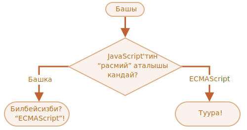

маанилүүлүк: 2

---

# JavaScript'тин аталышы

`if..else` түзүлүшүн колдонуп, 'JavaScript-тин "расмий" аталышы кандай?' деп сураган кодду жазыңыз.

If the visitor enters "ECMAScript", then output "Right!", otherwise -- output: "You don't know? ECMAScript!"
Эгерде келүүчү "ECMAScript" киргизсе, "Туура!" көрсөтүү, антпесе "Билбейсизби? ECMAScript!" көрсөтүү.

[demo src="ifelse_task2"]
