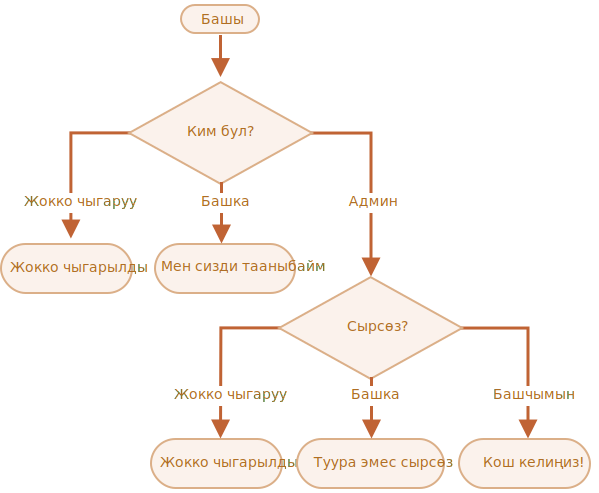

маанилүүлүк: 3

---

# Логинди текшериңиз

Логинди `prompt` менен сураган кодду жазыңыз.

Эгерде келүүчү `Админ` киргизсе, анда `prompt` менен сырсөздү киргизүүгө сунуш кылыңыз. Эгерде бош сап киргизилсе же `key:Esc` басылса -- "Жокко чыгарылды" көрсөтүңүз. Эгерде башка сап киргизилсе - анда "Мен сизди тааныбайм" көрсөтүңүз.

Сырсөз төмөнкүдөй текшерилет:

- Эгер ал "Башчымын" менен барабар болсо, анда "Кош келиңиз!" көрсөтүңүз,
- Башка сап болсо -- "Туура эмес сырсөз" көрсөтүңүз,
- Бош сап же жокко чыгарылган киргизүү үчүн "Жокко чыгарылды" көрсөтүңүз.

Схемасы:

Сураныч, камтылган `if` блокторун колдонуңуз. Коддун жалпы окулушуна көңүл буруңуз.

Кеңешме: сурамга бош киргизүүнү өткөрүү бош сапты `''` кайтарат. Сурам учурунда `key:ESC` басылганда `null` кайтарылат.

[demo]
